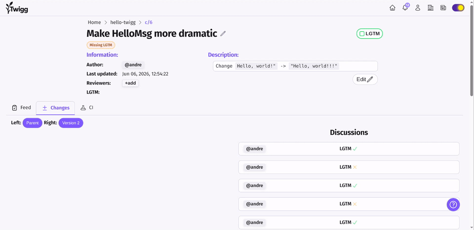

  <picture>
    <source media="(prefers-color-scheme: dark)" srcset="twigg-web/handlers/landing/files/logo.png">
    
  </picture>

  
  
  

# What is it?

Twigg is the **open source alternative to [Critique](#whats-critique)**.

Critique is the tool Google's engineers use every day to collaborate on software. Twigg is that workflow, built in the open, for everyone. It is **not** a Git wrapper: everything was written from scratch.

  

Compared to other version control systems, Twigg is more opinionated and built for one specific scenario: **collaboration in closed teams**. It implements the battle-tested workflow used across big tech for high-velocity, safe collaboration:

- **Trunk-based development**: a single main development branch, no long-lived feature branches.
- **Small incremental changes**: changes are independently reviewed and submitted in small commits that build on top of each other (stacked commits).

This workflow is possible without Twigg, but painful and only works if everyone remembers to follow it. In Twigg it's the default, and everything else is built around it:

- **Hierarchical Code Ownership**: OWNERS files, with ownership cascading down directories
- **Efficient Code Review**: designed for reviewing stacked changes that evolve based on feedback, version by version
- **Integrated CI/CD**: built to run on the trunk and to only trigger based on modified paths

Full documentation: [twigg.vc/docs](https://twigg.vc/docs/v/2/)

# Why is this on GitHub?
Naturally, we eat our own dogfood: Twigg is developed using Twigg.
The actual development happens on our hosted instance at [twigg.vc](https://twigg.vc).
However, Twigg doesn't yet support public repositories, so we use GitHub as a 
read-only mirror.

# What's in this repo?
Basically everything but "secrets" (i.e. passwords).
If you look around, you'll see this repository contains not only all the source code but even the runbooks we use to deploy our services. This is intentional. We can't rely on security through obscurity, and we believe radical transparency is essential to the success of this project.

# Getting started

We host Twigg under [twigg.vc](https://twigg.vc) with free and paid plans so you can easily try it out without having to self-host.

It offers [Git Mirror](https://twigg.vc/docs/v/2/git-mirror/) functionality: all submitted commits are pushed to a Git repository. This allows you to test it out but easily switch back to a Git server if needed.

See a tutorial [here](https://twigg.vc/docs/v/2/category/getting-started).

# FAQ

## Why is it called Twigg?
A twig is a short branch - which is what Twigg wants your branches to be.

## Is it production ready?
Yes. Twigg has been used in production for more than a year not only for Twigg's own development but also by 3 partner companies.

That said, when compared to projects such as Git, Twigg is relatively new; so backups (which you can easily enable with the [Git Mirror](https://twigg.vc/docs/v/2/git-mirror/) functionality) are recommended.

## What's Critique?
Google's *awesome* internal code collaboration platform. Don't take our word for it:

- [Critique: Google's Code Review Tool](https://abseil.io/resources/swe-book/html/ch19.html) — how Critique works, from Google's own *Software Engineering at Google*.
- [How Google takes the pain out of code reviews](https://read.engineerscodex.com/p/how-google-takes-the-pain-out-of) — *"The number of useful comments decreases and review latency increases as the size of the change increases."*

# Running and building locally

All the build scripts use the Twigg CLI to tag the build commit number.
Thus, you must install the CLI before running any build script.

- Requirements: **go**
- `cd tw && go install`

To check the installation, run `tw version`.

## Running locally

Note: both servers only run on Linux.

**twigg-web** is the "main" web server you see in [twigg.vc](https://twigg.vc). It hosts repositories, the documentation, the CLI binaries and everything else. To run it locally:
- Requirements: **tw CLI**, **go**, **node** and [task](https://taskfile.dev/)
- `cd twigg-web && task setup && task run`

**twigg-track** is the server "in which the runners run" (hence the name *Track*), i.e. the server that runs CI/CD jobs. To run it locally:
- Requirements: **tw CLI**, **go**, **docker** (required for running jobs in containers) and **LXD** (required for running jobs in VMs)
- `cd twigg-track && task run`
- Tip: `task mock` runs it with a mocked runner instead - no docker or LXD required.

If both servers are running locally, twigg-web will post jobs to twigg-track.

You can then install the CLI following the local instance's docs.
The only caveat is: cloning a repo won't work because you must change the server's URL (which is set to `https://twigg.vc` by default for safety). To clone an example repository you should instead run:
`mkdir BookOne && cd BookOne && tw init && tw enable-unsafe-dev-mode true && tw unsafe-server http://localhost:9001/aang/BookOne`.
Then, generate a key in `http://localhost:9001/user-settings` and run `tw key <key copied from the browser>`. Running `tw pull` and `tw push` should now work.

## Building from source

Ensure you have all the required dependencies:
- **tw CLI** is required for any `task` build script
- **go** is required for any build
- [task](https://taskfile.dev/) and **make** are used for build scripts
- **docker** and **LXD** are required for running jobs in the CI/CD server
- **node** is used to build the VSCode extension and the *web components* used by twigg-web

Build commands:
- `cd twigg-web && task setup && task build`: download node deps and build the web server. Note that this also builds the CLI for all platforms and embeds them into the binary.
- `cd twigg-track && task build`: build the CI/CD server.
- `cd twigg-vscode && make setup && make install`: install the VSCode extension.

To run all tests: `make test-all` from repo root

# License

This project is licensed under the GNU Affero General Public License v3.0 (AGPL-3.0).

**Notice:** Unless otherwise noted, all files in this repository are covered by this license.

See `LICENSE.txt` for the full license text.