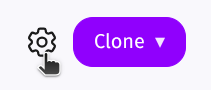

import Tabs from '@theme/Tabs';
import TabItem from '@theme/TabItem';
import GitLabMirrorUrlGenerator from "@site/src/components/GitLabMirrorUrlGenerator";

# GitLab

### First you must provide an access token.

GitLab offers different types of access tokens depending on your subscription tier.

<Tabs
  defaultValue="premium"
  groupId="gitlab-token"
  queryString="gitlab"
>
  <TabItem value="premium" label="Premium / Ultimate">

#### Create a Project Access Token

1. Go to your GitLab project <input type="checkbox"/>

2. Navigate to `Settings` > `Access Tokens` <input type="checkbox"/>

3. Click **Add new token**  button <input type="checkbox"/>

4. Choose a name, for example: `twigg-mirror-<YOUR-REPO-NAME>` <input type="checkbox"/>

5. Select an expiration date (feel free to choose a long duration). <input type="checkbox"/>

6. Select a role for the token: `Developer` (or equivalent). <input type="checkbox"/>

7. Select the following scopes: <input type="checkbox"/>
   - `read_repository`
   - `write_repository`

8. Click **Create project access token** button <input type="checkbox"/>

9. Copy the generated token. <input type="checkbox"/>

  </TabItem>

  <TabItem value="free" label="Free">

#### Create a Personal Access Token

1. In the upper-right corner, select your avatar. <input type="checkbox"/>

2. Select **Edit profile**. <input type="checkbox"/>

3. On the left sidebar, select **Personal access tokens**. <input type="checkbox"/>

4. Click **Add new token** button <input type="checkbox"/>

5. Choose a name, for example: `twigg-mirror-<YOUR-REPO-NAME>` <input type="checkbox"/>

6. Select an expiration date (feel free to choose a long duration). <input type="checkbox"/>

7. Select the following scopes: <input type="checkbox"/>
   - `read_repository`
   - `write_repository`

8. Click **Generate token** button <input type="checkbox"/>

9. Copy the generated token. <input type="checkbox"/>

  </TabItem>
</Tabs>

---

### Set GitLab mirror in Twigg

1. Go to [home](https://twigg.vc/home) and open your repository. <input type="checkbox"/>

2. Click the repository settings icon.   <input type="checkbox"/>  
   

3. Scroll to **Git Mirror** section and click on the switch button to enable it. <input type="checkbox"/>

4. Construct your mirror URL <input type="checkbox"/>

<GitLabMirrorUrlGenerator />  

5. Click `Save URL`. <input type="checkbox"/>

**Your setup is complete**. From now on, any commits submitted in Twigg will be automatically pushed to the `twigg` branch of the mirrored repository GitLab.