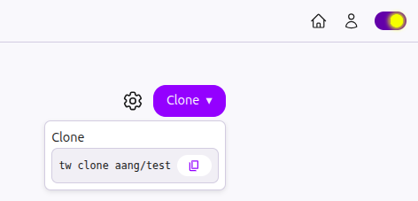
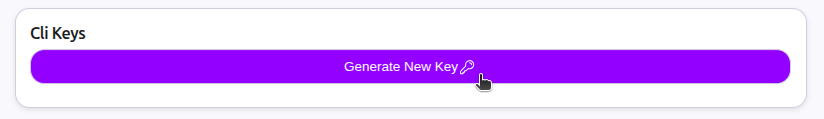
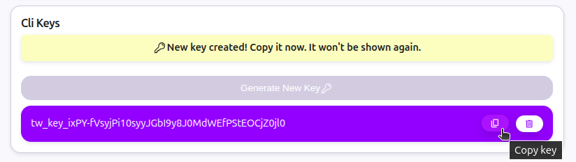

# 3. Clone repository
On your repository page, click the `Clone` button in the top right corner. Click the `Copy` icon to copy the clone command.



Open your terminal. Navigate to the folder where you want to clone your repository and paste the command you just copied.
```
tw clone <YOUR-USERNAME>/<YOUR-REPO-NAME>
```
Twigg will ask for your CLI Key. The server uses it to know who you are.
To generate a CLI Key:
 * Go to [User settings](http://twigg.vc/user-settings)
 * Scroll to the bottom and click on `Generate New Key` button.



 * Your CLI Key (tw_key_...) will be displayed. Copy it immediately. It won’t be shown again.



 * Go back to your terminal and paste the Key you just copied.

 ```
 $ tw clone <YOUR-USERNAME>/<YOUR-REPO-NAME>
 What's your CLI key? (get it under /user-settings)
 <PASTE YOUR CLI KEY>
 ```