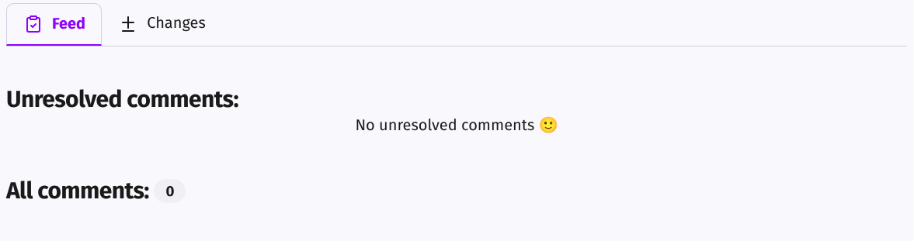
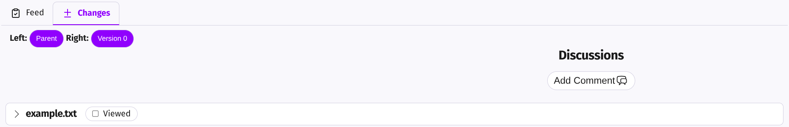
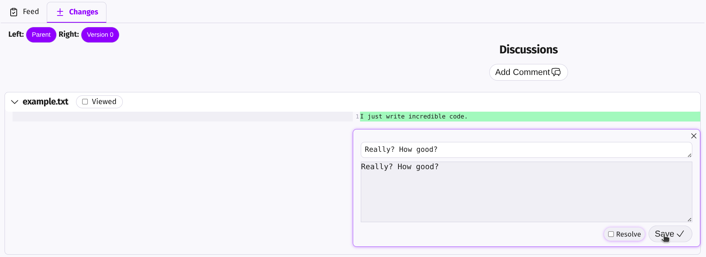
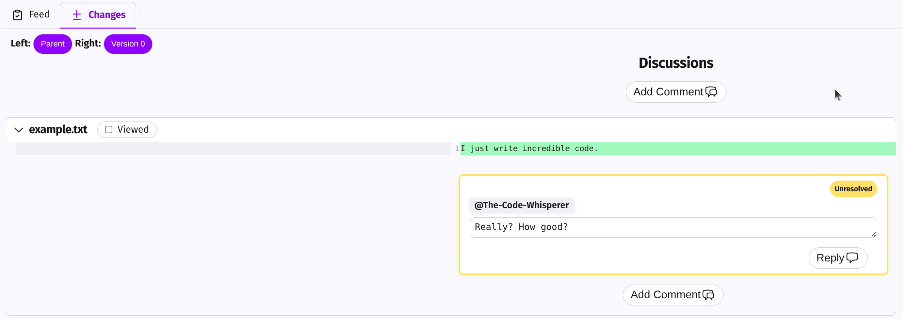

# 6. Review your commit

At the bottom of your screen, you’ll see the `Feed` and `Changes` tabs. Click on the `Changes` tab.

By default, you’ll see the changes this commit made with respect to the parent commit. 

By clicking on a file, you can view its changes.
At this stage, others will review your commit.
Let's pretend that someone added a comment to the file we created:

Now we have an `unresolved comment` in commit `Version 0`. Let’s fix it.

