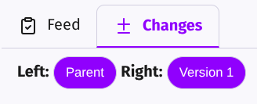
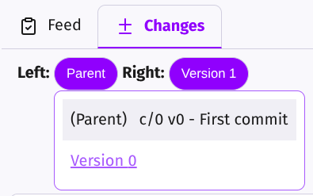
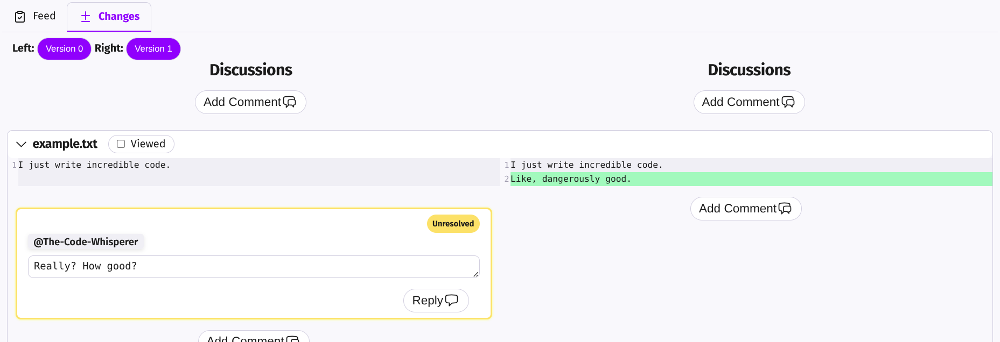
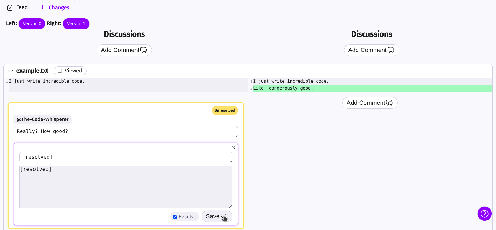

# 8. Resolve comments 

Below your `Changes` tab, you can select versions to compare how the commit evolved.

Click on `parent` and change it to `Version 0`. This way, Twigg shows only what you’ve changed since the last version.

Click on `example.txt` to open it and you should see something like this:

Since we fixed what was asked, we can resolve the comment:
(`Reply` → `[x]Resolve` → `Save`)

